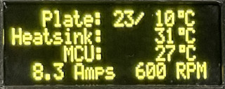

# Intelligent Cooling Plate with PIC16F17146

Packed with more peripherals than I/O pins, this intelligent cooling plate (aka: the cold plate) cools it's the metal surface and anything on top of it. Controlling this system is a single 20-pin, 8-bit MCU, which performs temperature measurements, peltier current monitoring, user interface control, and safety functions. This MCU can handle this task single-handedly due to the wide array of Core Independent Peripherals (CIPs) on the device.

This README covers a brief usage guide, and other surface level info about the demo. The cold plate was made so different aspects/functionalities of the microcontroller could be copied/adapted to various applications, rather than the intention someone would build their own cold plate. Because of this, there is no how-to guide to build up the hardware. However, all PCB, CAD files, and non-standard BOM components are included in the repo for reference.

<!--ADD IN LATER AFTER APP NOTE IS PUBLISHED: For in-depth information on the implementation details of this demo, check out the app note listed in the related documentation. -->

## Related Documentation
- [PIC16F17146 Datasheet](https://ww1.microchip.com/downloads/aemDocuments/documents/MCU08/ProductDocuments/DataSheets/-PIC16F17126-46-Full-Featured-Microcontrollers-Data-Sheet-40002343C.pdf)
- [EA OLEDM204 Datasheet](https://www.lcd-module.de/fileadmin/html-seiten/eng/pdf/doma/oledm204-ae.pdf)
- [CP85438 Peltier Plate](https://www.cuidevices.com/product/resource/cp85.pdf)
- [PS103J2 NTC Thermistors](https://www.littelfuse.com/products/temperature-sensors/leaded-thermistors/interchangeable-thermistors/standard-precision-ps/ps103j2.aspx)

## Software Used

- [MPLAB® X IDE v6.0.0](https://www.microchip.com/en-us/tools-resources/develop/mplab-x-ide?utm_source=GitHub&utm_medium=TextLink&utm_campaign=MCU8_MMTCha_pic171xx&utm_content=pic16f17146-cold-plate-mplab-mcc-github) or newer
- [MPLAB XC8 v2.36.0](https://www.microchip.com/en-us/tools-resources/develop/mplab-xc-compilers?utm_source=GitHub&utm_medium=TextLink&utm_campaign=MCU8_MMTCha_pic171xx&utm_content=pic16f17146-cold-plate-mplab-mcc-github) or newer
- [MPLAB Code Configurator](https://www.microchip.com/en-us/tools-resources/configure/mplab-code-configurator?utm_source=GitHub&utm_medium=TextLink&utm_campaign=MCU8_MMTCha_pic171xx&utm_content=pic16f17146-cold-plate-mplab-mcc-github) (MCC)
- [MPLAB Mindi&trade; Analog Simulator](https://www.microchip.com/en-us/tools-resources/develop/analog-development-tool-ecosystem/mplab-mindi-analog-simulator?utm_source=GitHub&utm_medium=TextLink&utm_campaign=MCU8_MMTCha_pic171xx&utm_content=pic16f17146-cold-plate-mplab-mcc-github)

## Hardware Used

- [PIC16F17146 DIP](https://www.microchip.com/en-us/product/PIC16F17146)
- [Curiosity Development Board](https://www.microchip.com/en-us/development-tool/dm164137) (used during development)

## Major Functions

<!-- TODO after app note is published: In depth information on each major function system can be found in the App Note in related documentation. -->
These are the major functions are implemented on the microcontroller.

**Current Monitoring and Measurement**  
- Integrated Operational Amplifier (OPA1)  
- Analog Comparators 1 and 2 (CMP1 and CMP2)  
- Digital-to-Analog Converters 1 and 2 (DAC1, DAC2) 
- Analog-to-Digital Converter with Computation (ADCC)
- Fixed Voltage Reference (FVR)

OPA1 is implemented as a current-sense amplifier, which amplifies the small voltage across the current shunt resistor. The output of OPA1 is used internally for multiple functions. DAC1 and CMP1 are used to detect whether current is flowing through the loop. This allows the system to determine if a fuse has blown, or another failure has occurred.  DAC2 and CMP2 are used to detect overcurrent events. If the Peltier was shorted out, then this detector will trigger an interrupt to shutdown the system.

Additionally, the current is measured for telemetry by the ADCC, with the FVR providing the appropriate voltage reference.

**Cold plate, heatsink, and MCU temperature monitoring**
- Analog-to-Digital Converter with Computation (ADCC)
- Fixed Voltage Reference (FVR)
- Temperature Indicator Module (TEMP)

The microcontroller monitors the temperature in the system by measuring NTC thermistors for the cold plate and it's heatsink. Additionally, the TEMP peripheral in the MCU is also measured. The ADCC uses the FVR to ensure measurements are stable, and to provide the appropriate voltage for the TEMP peripheral. 

**Functional Safety Supported Setting Storage**
- Cyclic Redundancy Check (CRC) with Memory Scanner 
- Non-Voltatile Memory (NVM) Control

Using the NVM and CRC CIPs, user settings are saved to EEPROM along with a checksum. On startup, the user settings and checksum are scanned to ensure the EEPROM is valid before loading the settings. The CRC peripheral reduces code size and executes faster than if the same functionality was implemented in software.
 
**Protective System Monitoring**
- Timer 0 (TMR0)
- Windowed Watchdog Timer (WWDT)

Since the cold plate involves high currents and potentially hazardous temperatures, the WWDT is used to ensure periodic monitoring of the device is performed. If the WWDT is not triggered within a specific time, the microcontroller will reset. This ensures that if the firmware ever deadlocked, the system would not remain active for long. TMR0 generates the base timing for the periodic self check.

**Single Speed Fan Control with Dual Fan Speed Monitoring**
- Pulse Width Modulator with Compare 2 (PWM2)
- Timer 2 and 4 (TMR2 and TMR4)

To cool the Peltier plate, a PWM peripheral is used to generate a speed control signal for system fans. This allows the fans to ramp up and down depending on the conditions of the system. Additionally, the tachometer signals from the fans are monitored and counted by TMR2 and TMR4. Fan 1 is monitored by the microcontroller to ensure it is operating. If Fan 1 is not spinning, the system will not power-up the Peltier plate. 

**User Interface**
- Host Synchronous Serial Port 1 (MSSP1), in I2C mode
- Timer 1 and 3 (TMR1 and TMR3)
- Configurable Logic Cell 1 and 2 (CLC1 and CLC2)
- Pulse Width Modulator with Compare 1 (PWM1)

The user interacts with the cold plate through a pushbutton rotary encoder and an OLED display. The OLED is controlled with the on-chip MSSP1 module via I2C. Since there is dedicated MSSP hardware, the CPU can load data into the module, rather than bit-banging the I/O lines. 

The rotary encoder inputs go into 2 CLCs to convert the signal into clockwise and counter-clockwise pulses (depending on direction). The pulses go into TMR1 and TMR3, which act as counters. This means the CPU doesn't need to track rotary encoder movements. 

Lastly, the rotary encoder has 2 LEDs built-in - an orange and a blue LED. Using PWM1, these lights are used to generate visual indication of the cold plate's status:

| Color | Cold plate status |
| --- | --- |
| Breathing Purple | Standby |
| Breathing Blue | Actively Cooling |
| Sold Blue | At Target Temperature |
| Solid Orange | Error |

**Misc Other Functions**
- Enhanced Universal Synchronous Asynchronous Receiver
Transmitter (EUSART1)

EUSART1 is used to transmit debug messages from the microcontroller. It is setup to run at 115200 baud, 8 data bits and 1 stop bit. 

## Operation

On boot, a standby screen shows the current plate temperature, the set temperature, and whether the product is in demo mode (which limits the lowest temperature for safety)

Pressing the rotary encoder button brings up a menu that can be used to change various running parameters:

| Name | Function |
| --- | --- |
| Go Back | Return to Standby screen |
| Start | Turn on plate, go to running status screen |
| Set Temperature | Changes target temperature |
| Hysteresis | Configures temperature hysteresis |
| Change Units | Select Celsius or Fahrenheit units|
| Show Icons | Display text or icons in running status screen |
| About | Lists developer and version info |
| Demo Mode Toggle | Password protected way to disable demo mode|

Upon pressing `Start`, the MCU begins checking for various errors, and if all checks pass, the plate power is enabled and the user is brought to a running status screen which shows the plate target temp, current temp, heatsink temp, MCU temp, current being drawn, and heatsink fan RPM.

If an error occurs, power to the plate is cut, and a troubleshooting error message displays on the screen. Press the rotary encoder to clear the error and return to the standy screen. If the error is not remedied and the plate is started again, it will loop back to the same error screen.

Below is a list of the various possible errors that are continuously checked for during running operation:

| Name | Error Code | Cause |
| ---- | ----------- |--- |
| PELTIER_FAN1_ERROR | 1 | The heatsink fan is unplugged |
| PELTIER_OVERCURRENT_ERROR | 2 | More current is pulled than software allows |
| PELTIER_POWER_ERROR | 3 | No power is detected when the plate should be pulling current |
| PELTIER_GAIN_ERROR | 4 | The gain of the operational amplifier exceeds expected tolerance.
| PELTIER_INT_OVERHEAT | 5 | Internal MCU temperature is too hot (70C)|
| PELTIER_HEATSINK_OVERHEAT | 6 | Heatsink is too hot (80C)|
| PELTIER_SENSE_HOT_OPEN | 7 | Thermocouple for heatsink is disconnected |
| PELTIER_SENSE_COLD_OPEN | 8 | Thermocouple for plate temp is disconnected |
| PELTIER_PLATE_TEMP_LIMIT | 9 | Cold plate is below safe temperature |

Once started, pressing the rotary encoder button and selecting `Cancel` stops the plate and returns to the standby menu.

## Summary
This README covered a brief overview of the functionality of The Cold Plate as well as cover a usage overview. 

<!-- TODO: Add after app note is published: More in-depth information can be found in the app note listed in [Related Documentation](#related-documentation). -->
